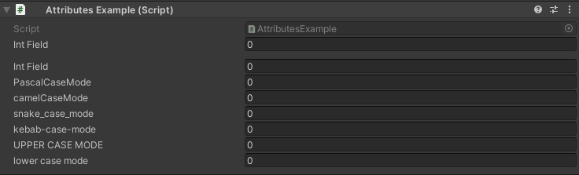
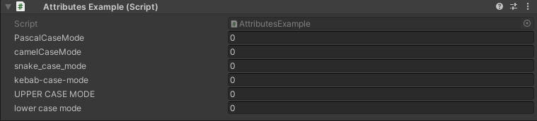

Rename Attribute
================

Attribute to rename a field in the inspector

**Parameters:**
	- ``string`` name: The new name of the field
	- `optional`, ``CaseType`` caseType: In what case to rename the field

Example::

	using UnityEngine;
	using EditorAttributes;
	
	public class AttributesExample : MonoBehaviour
	{
		[SerializeField] private int intField;
		[Space]
		[SerializeField, Rename("Int Field")] private int secondIntField;
	}
	
Usefull for when you want two or more fields to have the same name in the inspector.

You can also apply different case types to the name like so::

	using UnityEngine;
	using EditorAttributes;
	
	public class AttributesExample : MonoBehaviour
	{
		[SerializeField, Rename("pascal case mode", CaseType.Pascal)] private int intField1;
		[SerializeField, Rename("Camel Case mode", CaseType.Camel)] private int intField2;
		[SerializeField, Rename("snake case mode", CaseType.Snake)] private int intField3;
		[SerializeField, Rename("kebab case mode", CaseType.Kebab)] private int intField4;
		[SerializeField, Rename("upper case mode", CaseType.Upper)] private int intField5;
		[SerializeField, Rename("LOWER CASE MODE", CaseType.Lower)] private int intField6;
	}

