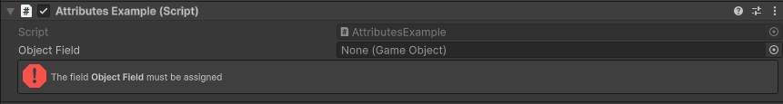
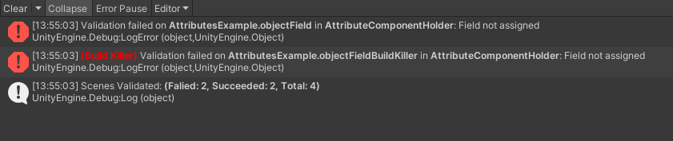
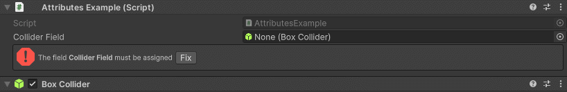
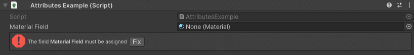

Required Attribute
==================

Attribute that validates a null field in the inspector.

**Parameters:**
	- ``string`` customFixFunctionName: The name of the custom function to run by the Fix button
	- `optional`, ``bool`` throwValidationError: Throws an error in the console if validation fails
	- `optional`, ``bool`` buildKiller: Throws an error during build time and cancels it if validation fails
	- `optional`, ``ReferenceFixMode`` fixMode: Specifies how the field should be auto-referenced by the Fix button

Example::

	using UnityEngine;
	using EditorAttributes;
	
	public class AttributesExample : MonoBehaviour
	{
		[SerializeField, Required] private GameObject objectField;
	}

If you want to include a required field in the validation process set *throwValidationError* to ``true``::

	using UnityEngine;
	using EditorAttributes;
	
	public class AttributesExample : MonoBehaviour
	{
		[SerializeField, Required(true)] private GameObject objectField;
		[SerializeField, Required(true, true)] private GameObject objectFieldBuildKiller;
	}

For more details on validation see the :doc:`validate`.

You can have the required field be auto-referenced by setting the `fixMode` parameter to one of the defined values::

	using UnityEngine;
	using EditorAttributes;
	
	public class AttributesExample : MonoBehaviour
	{
		[SerializeField, Required(fixMode: ReferenceFixMode.Auto)] private BoxCollider colliderField;
	}

Now a small "Fix" button will show up on the help box and pressing it will assign the field if there is a valid reference found.

You can choose one of the following options to specify how the reference will be fixed:

- ``ReferenceFixMode.None``: Auto-referencing is disabled and the "Fix" button will be hidden. This is default behaviour.
- ``ReferenceFixMode.Auto``: Attempts to grab a reference from `Self -> Children -> Parents -> Scene` in that order until a reference is found.
- ``ReferenceFixMode.Self``: Attempts to grab a reference from itself.
- ``ReferenceFixMode.Children``: Attempts to grab a reference from it's children.
- ``ReferenceFixMode.Parents``: Attempts to grab a reference from it's parents.
- ``ReferenceFixMode.Scene``: Attempts to grab a reference from the first loaded object in the scene that matches the field type.
- ``ReferenceFixMode.Custom``: A custom function will be used to auto-reference the field. This is set by default when using the constructor with the `customFixFunctionName` parameter.

If the reference you want to assign requires additional logic you can create a custom function returning an ``UnityEngine.Object`` to be called by the "Fix" button.
This is usefull in scenarios where you want to assign a loaded asset.

	using UnityEngine;
	using EditorAttributes;
	
	public class AttributesExample : MonoBehaviour
	{
		[SerializeField, Required(nameof(GetFieldReference))] private Material materialField;

		private Object GetFieldReference() => Resources.Load("ExampleMaterial");
	}

This is also the only valid way to add auto-referencing for fields that are part of an asset `(ex. ScriptableObjects)`.
