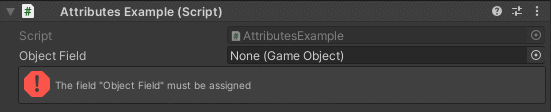

Required Attribute
==================

Attribute that validates a null field in the inspector

**Parameters:**
	- ``bool`` throwValidationError: Throws an error in the console if validation fails
	- ``bool`` buildKiller: Throws an error during build time and cancels it if validation fails

Example::

	using UnityEngine;
	using EditorAttributes;
	
	public class AttributesExample : MonoBehaviour
	{
		[SerializeField, Required] private GameObject objectField;
	}

If you want to include a required field in the validation process set **throwValidationError** to ``true``::

	using UnityEngine;
	using EditorAttributes;
	
	public class AttributesExample : MonoBehaviour
	{
		[SerializeField, Required(true)] private GameObject objectField;
		[SerializeField, Required(true, true)] private GameObject objectFieldBuildKiller;
	}

.. image:: ../../Images/Required02.png

For more details on validation see the :doc:`validate`.
