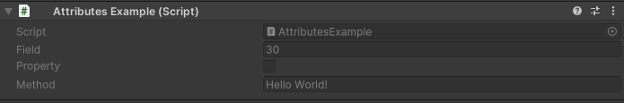

ShowInInspector Attribute
=========================

Attribute to show a non serialized member in the inspector.

.. note::
	The attribute doesn't support nested properties.

You can use this attribute on any non serialized field, property or method::

	using UnityEngine;
	using EditorAttributes;
	
	public class AttributesExample : MonoBehaviour
	{
		[ShowInInspector]
		private readonly int field = 30;

		[ShowInInspector]
		private bool Property { get; set; }

		[ShowInInspector]
		public static string Method() => "Hello World!";
	}

.. note::
	Since the fields marked with this attribute are drawn in a custom way, property drawers will not affect it.
