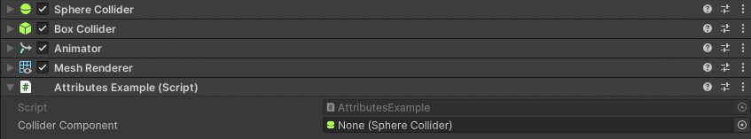
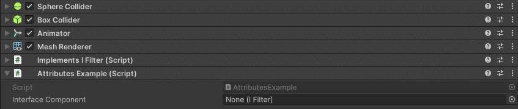

TypeFilter Attribute
====================

Attribute to only allow assignment of objects that are or derive from the specified types

**Parameters:**
	- `params`, ``object`` objectType: The type of objects to filter

In this example only components of type ``SphereCollider`` can be assigned into the inspector field::

	using UnityEngine;
	using EditorAttributes;
	
	public class AttributesExample : MonoBehaviour
	{
		[SerializeField, TypeFilter(typeof(SphereCollider))] private Component colliderComponent;
	}

While using this attribute to filter only one type may not be too usefull since you can just make the field of the type you want to assign, but you can also filter multiple types::

	using UnityEngine;
	using EditorAttributes;
	
	public class AttributesExample : MonoBehaviour
	{
		[SerializeField, TypeFilter(typeof(SphereCollider), typeof(BoxCollider))] private Component colliderComponent;
	}
	
Now only components of type ``SphereCollider`` and ``BoxCollider`` can be assigned.

The best use of this attribute is to filter types that inherit from a certain interface::

	using UnityEngine;
	using EditorAttributes;
	
	public class AttributesExample : MonoBehaviour
	{
		[SerializeField, TypeFilter(typeof(IFilter))] private Component interfaceComponent;
	}

Now you will only be able to assign components in the inspector that inherit from the specified interface.

