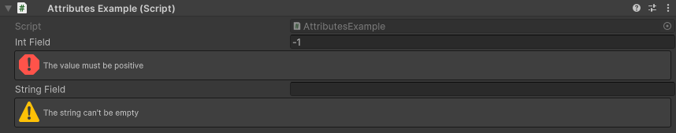
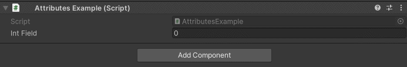
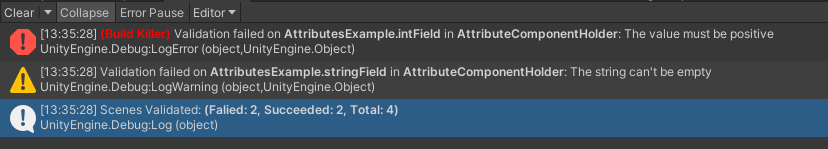
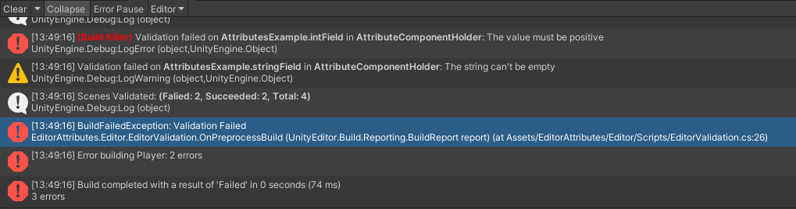

Validate Attribute
==================

Attribute to create custom validation

**Parameters:**
	- ``string`` validationMessage: The message to display in the console when validation fails
	- ``string`` conditionName: The name of the condition to evaluate
	- `optional`, ``MessageMode`` severety: The severety of the failed validation
	- `optional`, ``bool`` buildKiller: Throws an error during build time and cancels it if validation fails

Example::

	using UnityEngine;
	using EditorAttributes;
	
	public class AttributesExample : MonoBehaviour
	{
		[Validate("The value must be positive", nameof(CheckNegative), buildKiller: true)] 
		[SerializeField] private int intField;
		
		[Validate("The string can't be empty", nameof(CheckEmpty), MessageMode.Warning)] 
		[SerializeField] private string stringField;

		private bool CheckNegative => intField < 0;
		private bool CheckEmpty() => stringField == string.Empty;
	}

If you want to do more advanced validation like doing multiple validations on one field you can use a function returning a :doc:`../../Scripting API/validationcheck`::

	using UnityEngine;
	using EditorAttributes;
	
	public class AttributesExample : MonoBehaviour
	{
		[Validate(nameof(AdvancedCheck))]
		[SerializeField] private int intField;
	
		private ValidationCheck AdvancedCheck()
		{
			if (intField < 0)
				return ValidationCheck.Fail("Number can't be less than 0", MessageMode.Error, true);
	
			if (intField > 100)
				return ValidationCheck.Fail("Number can't be more than 100", MessageMode.Warning);
	
			return ValidationCheck.Pass();
		}
	}

To validate your project go to the engine toolbar and look for *Tools/EditorValidation* and select whatever you want to validate.

.. image:: ../../Images/Validate03.png

- **Validate All** combines the process of **Validate Assets** and **Validate Scenes**.
- **Validate Assets** will validate every prefab and scriptable object inside the Assets folder.
- **Validate Scenes** will validate every scene in the active scene list in the build settings.
- **Validate Open Scenes** will validate every scene currently loaded in the hierarchy whether is added in the active build settings scene list or not.
- **Disable Build Validation** option to disable validation when building the game, this option will not persist between editor sessions.

Once you select what you want to validate it will begin the validation process. Note that the validation process may take a while depending on the size of the project.
When is done it will throw some logs in the console with the results of the validation and errors for failed validations.

Notice how one of the validations has a red *(Build Killer)* text. Those appear when you set the *buildKiller* parameter to ``true``, what it means is that when you are trying to build the project
if you have any failed validations marked as a build killer it will cancel the build and throw the validation logs in the console.

