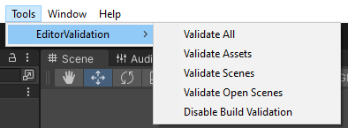

Validate Attribute
==================

Attribute to create custom validation

**Parameters:**
	- ``string`` validationMessage: The message to display in the console when validation fails
	- ``string`` conditionName: The name of the condition to evaluate
	- `optional`, ``MessageMode`` severety: The severety of the failed validation
	- `optional`, ``bool`` buildKiller: Throws an error during build time and cancels it if validation fails

Example::

	using UnityEngine;
	using EditorAttributes;
	
	public class AttributesExample : MonoBehaviour
	{
		[SerializeField, Validate("The value must be positive", nameof(CheckNegative), buildKiller: true)] private int intField;
		[SerializeField, Validate("The string can't be empty", nameof(CheckEmpty), MessageMode.Warning)] private string stringField;

		private bool CheckNegative => intField < 0;
		private bool CheckEmpty() => stringField == string.Empty;
	}

.. image:: ../../Images/Validate01.png

To validate a scene go to the engine toolbar and look for *EditorValidation* and select whatever you want to validate.

Once you select what you want to validate it will begin the validation process. Note that the validation process may take a while depending on the size of the project.
When is done it will throw some logs in the console with the results of the validation and any errors for failed validations.

.. image:: ../../Images/Validate02.png

Notice how one of the validations has a red *(Build Killer)* text. Those appear when you set the **buildKiller** parameter to ``true``, what it means is that when you are trying to build the project
if you have any failed validations marked as a build killer it will cancel the build and throw the validation logs in the console.

