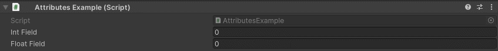
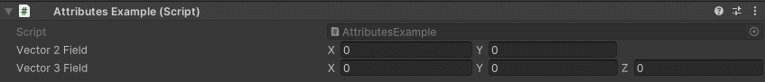

Clamp Attribute
===============

Attribute to clamp a numeric field between two values

**Parameters:**
	- ``float`` minValue: The min value to clamp
	- ``float`` maxValue: The max value to clamp
	- ``float`` minValueX: The min value to clamp on X
	- ``float`` maxValueX: The max value to clamp on X
	- ``float`` minValueY: The min value to clamp on Y
	- ``float`` maxValueY: The max value to clamp on Y
	- ``float`` minValueZ: The min value to clamp on Z
	- ``float`` maxValueZ: The max value to clamp on Z
	- ``float`` minValueW: The min value to clamp on W
	- ``float`` maxValueW: The max value to clamp on W

Example::

	using UnityEngine;
	using EditorAttributes;
	
	public class AttributesExample : MonoBehaviour
	{
		[SerializeField, Clamp(-10, 10)] private int intField;
		[SerializeField, Clamp(-5.5f, 5.5f)] private float floatField;
	}

Now the values will be clamped between the min and max specified

By default, on vectors the provided min and max will affect all axis, but you can also provide different min max values for different axis::

	using UnityEngine;
	using EditorAttributes;
	
	public class AttributesExample : MonoBehaviour
	{
		[SerializeField, Clamp(-10f, 10f, -5f, 5f)] private Vector2 vector2Field;
		[SerializeField, Clamp(-10f, 10f, -5f, 5f, -1, 1f)] private Vector3 vector3Field;
	}

Now the values of each axis will be clamped between the min and max specified for their axis

.. note::
	Quaternions are not supported because they are weird
