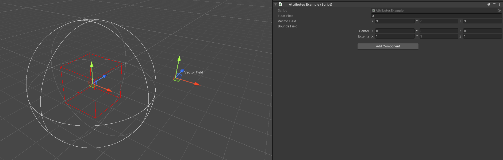
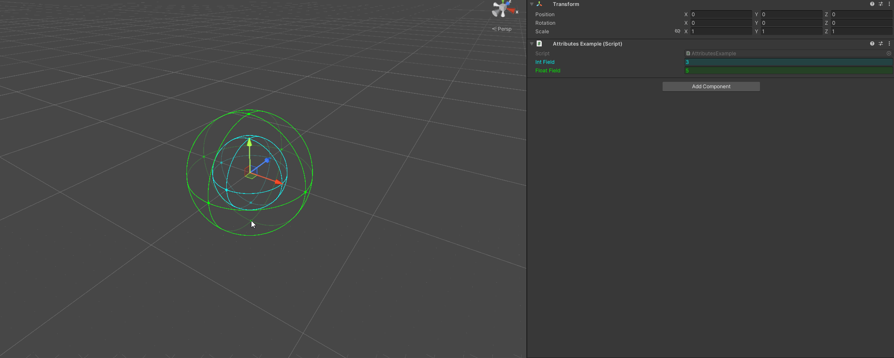
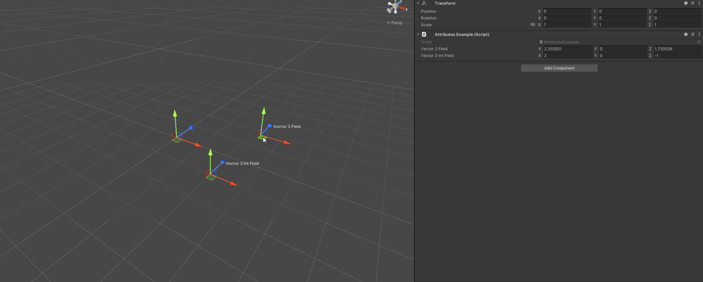
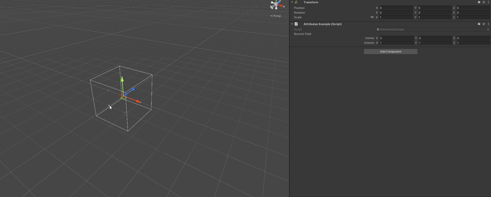
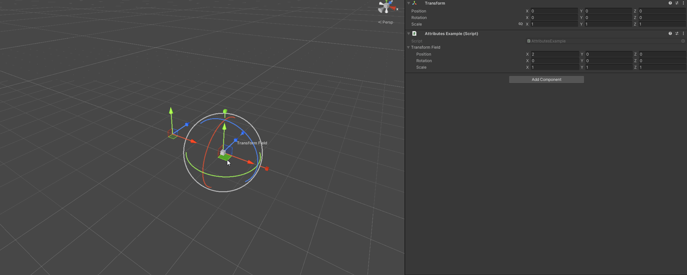
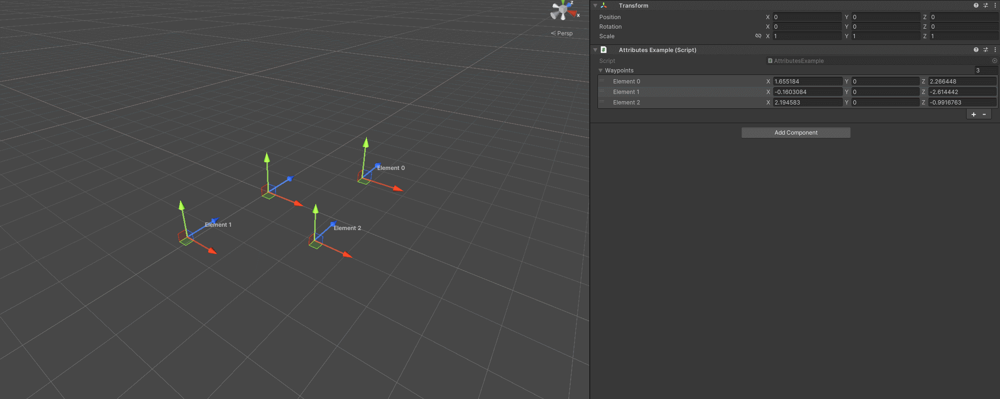

DrawHandle Attribute
====================

Draws a handle for the appropriate type

**Parameters:**
	- ``float`` red: Red amount
	- ``float`` green: Green amount
	- ``float`` blue: Blue amount
	- ``string`` hexColor: The color in hexadecimal
	- `optional`, ``GUIColor`` color: The color of the handle
	- `optional`, ``Space`` handleSpace: In which coordinate space to place the handle

.. note::
	The `DrawHandle Attribute` can only be used on ``int``, ``float``, ``Vector2``, ``Vector2Int``, ``Vector3``, ``Vector3Int``, ``Bounds`` and ``SimpleTransform`` fields on *GameObjects*

Example::

	using UnityEngine;
	using EditorAttributes;
	
	public class AttributesExample : MonoBehaviour
	{
		[SerializeField, DrawHandle] private float floatField;
		[SerializeField, DrawHandle] private Vector3 vectorField;
		[SerializeField, DrawHandle(GUIColor.Red)] private Bounds boundsField;
	}

Here are handles for each supported type:

- ``int`` and ``float`` types

- Vector types

- ``Bounds`` type

- ``SimpleTransform`` type

By default the handles are in world space but you can also put them in local space by setting the **handleSpace** parameter::

	using UnityEngine;
	using EditorAttributes;
	
	public class AttributesExample : MonoBehaviour
	{
		[SerializeField, DrawHandle(handleSpace: Space.Self)] private Vector3[] waypoints;
	}

.. note::
	``Vector2Int`` and ``Vector3Int`` handles don't support local space.
