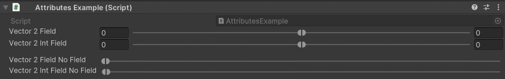

MinMaxSlider Attribute
======================

Attribute to draw a min max slider

**Parameters:**
	- ``minRange`` The minimum range of the slider
	- ``maxRange`` The maximum range of the slider
	- `optional`, ``showValues`` Show fields of the slider values

Example::

	using UnityEngine;
	using EditorAttributes;
	
	public class AttributesExample : MonoBehaviour
	{
		[SerializeField, MinMaxSlider(-10f, 10f)] private Vector2 vector2Field;
		[SerializeField, MinMaxSlider(-10f, 10f)] private Vector2Int vector2IntField;
		[Space]
		[SerializeField, MinMaxSlider(0f, 10f, false)] private Vector2 vector2FieldNoField;
		[SerializeField, MinMaxSlider(0f, 10f, false)] private Vector2Int vector2IntFieldNoField;
	}
	
