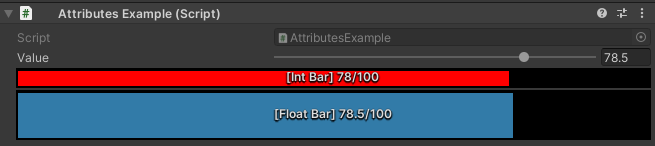

ProgressBar Attribute
=====================

Attribute to draw a progress bar

**Parameters:**
	- ``float`` maxValue: The maximum value of the progress bar
	- ``float`` barHeight: The height of the progress bar
	- ``float`` red: Filling bar red amount
	- ``float`` green: Filling bar green amount
	- ``float`` blue: Filling bar blue amount
	- ``string`` hexColor: The color of the bar filling in hexadecimals
	- `optional`, ``GUIColor`` color: The color of the bar filling

Moving the value slider will update the progress bar value::

	using UnityEngine;
	using EditorAttributes;
	
	public class AttributesExample : MonoBehaviour
	{
		[SerializeField, Range(0f, 100f)] private float value;
	
		[SerializeField, ProgressBar(GUIColor.Red)] private int intBar;
		[SerializeField, ProgressBar("#327ba8", 100f, 50f)] private float floatBar;
	
		void OnValidate()
		{
			intBar = (int)value;
			floatBar = value;
		}
	}
	

.. note:: 
	The `ProgressBar Attribute` can only be attached to numeric fields (``int``, ``float``, ``double``, etc.)
