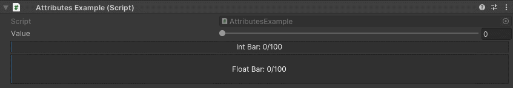

ProgressBar Attribute
=====================

Attribute to draw a progress bar

**Parameters:**
	- ``float`` maxValue: The maximum value of the progress bar
	- ``float`` barHeight: The height of the progress bar

Moving the value slider will update the progress bar value::

	using UnityEngine;
	using EditorAttributes;
	
	public class AttributesExample : MonoBehaviour
	{
		[SerializeField, Range(0f, 100f)] private float value;
	
		[SerializeField, ProgressBar] private int intBar;
		[SerializeField, ProgressBar(100f, 50f)] private float floatBar;
	
		void OnValidate()
		{
			intBar = (int)value;
			floatBar = value;
		}
	}
	

.. note:: 
	The `ProgressBar Attribute` can only be attached to numeric fields (``int``, ``float``, ``double``, etc.)
