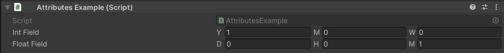
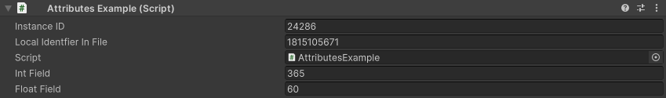

TimeField Attribute
===================

Attribute to display a numerical field as a specified time format and convert it to a single value

**Parameters:**
	- ``TimeFormat`` timeFormat: The format in which to display the time
	- ``Unit`` conversionUnit: The time unit to convert to

Example::

	using UnityEngine;
	using EditorAttributes;
	
	public class AttributesExample : MonoBehaviour
	{
		[SerializeField, TimeField(TimeFormat.YearMonthWeek, Unit.Days)] private int intField;
		[SerializeField, TimeField(TimeFormat.DayHourMinute, Unit.Seconds)] private float floatField;
	}

We can see the converted value in the debug view.

.. note::
	The `TimeField Attribute` can only be attached to ``float`` and ``int`` fields
