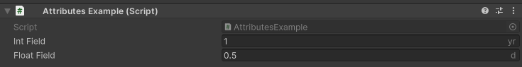
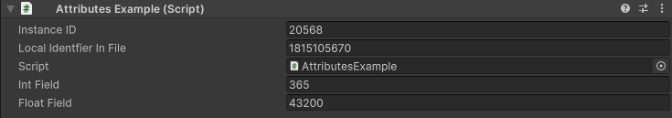
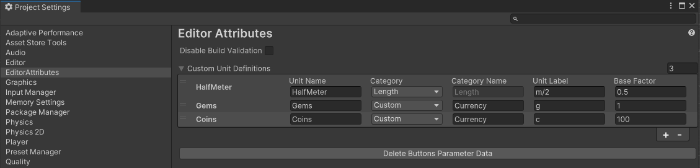
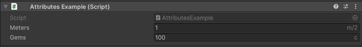
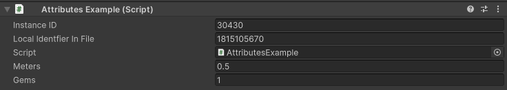

UnitField Attribute
===================

Attribute to display a numerical field as a specified unit and convert it to another unit

**Parameters:**
	- ``Unit`` displayUnit: The unit to display in the inspector
	- ``Unit`` conversionUnit: The unit to convert to
	- ``string`` customDisplayUnit: The custom unit to display in the inspector
	- ``string`` customConversionUnit: The custom unit to convert to

Example::

	using UnityEngine;
	using EditorAttributes;
	
	public class AttributesExample : MonoBehaviour
	{
		[SerializeField, UnitField(Unit.Year, Unit.Day)] private int intField;
		[SerializeField, UnitField(Unit.Day, Unit.Second)] private float floatField;
	}

We can see the converted values in the debug view.

You can define custom units in the :doc:`../../GettingStarted/editorattributessettings` and use them by passing them as a string in the attribute like this.

First we go `Edit/ProjectSettings/EditorAttributes` and add a new entry in the `Custom Unit Definitions` array and fill the data accordingly.

- The unit name will be used to identify the unit by the attribute. Be careful with white spaces or weird casing.
- You can either make your unit part of an existing category or create a custom category, you can only make conversions with units part of the same category.
- If you chose to create a custom category you can name your new category. Be careful with white spaces or weird casing here as well.
- The unit label will be used for displaying the unit in the field, so you can define your unit's symbol here.
- Base factor represents how much of the base unit is equal to 1 of this unit. If you create a new category you will need a base unit set to 1 that all conversions will be based on.

In the example I added 3 units:

- HalfMeter adds another unit to the Length category and it represents half of 1 meter. The base unit for the length category is the meter so 1 half meter is 0.5 meters
- Gems is the base unit of a new category called Currency so we set the base factor to 1.
- Coins is another unit part of the Currency category. 1 coin is equivalent to 0.01 gems so 100 coins is equal to 1 gem.

Now we pass the unit name of our custom defined unit in the attribute::

	using UnityEngine;
	using EditorAttributes;
	
	public class AttributesExample : MonoBehaviour
	{
		[SerializeField, UnitField("HalfMeter", Unit.Meter)] private float meters;
		[SerializeField, UnitField("Coins", "Gems")] private int gems;
	}

We can see the converted values in the debug view.

Here is a list of every base unit in the built-in categories:

- Time: Second
- Lenght: Meter
- Mass: Gram
- Volume: Liter
- Area: Square Meter
- Angle: Radian
- Speed: Meters Per Second
- Energy: Joule
- Power: Watt
- Pressure: Pascal
- Electric Current: Ampere
- Voltage: Volt
- Resistance: Ohm
- Capacitance: Farad
- Inductance: Henry
- Frequency: Hertz
- Data: Byte
- Density: Kilogram Per Cubic meter
- Fuel Economy: MilesPerGallon_US
- Percentage: Percent Multiplier
