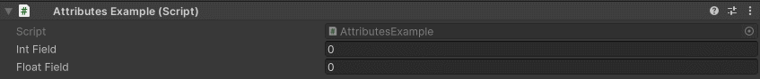
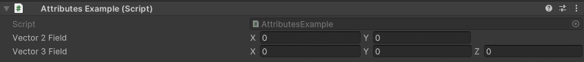

Wrap Attribute
==============

Attribute to wrap over a numeric value after it surpases it's limit

**Parameters:**
	- ``float`` minValue: The min value before it wraps arround
	- ``float`` maxValue: The max value before it wraps arround
	- ``float`` minValueX: The min value on X before it wraps arround
	- ``float`` maxValueX: The max value on X before it wraps arround
	- ``float`` minValueY: The min value on Y before it wraps arround
	- ``float`` maxValueY: The max value on Y before it wraps arround
	- ``float`` minValueZ: The min value on Z before it wraps arround
	- ``float`` maxValueZ: The max value on Z before it wraps arround
	- ``float`` minValueW: The min value on W before it wraps arround
	- ``float`` maxValueW: The max value on W before it wraps arround

Example::

	using UnityEngine;
	using EditorAttributes;
	
	public class AttributesExample : MonoBehaviour
	{
		[SerializeField, Wrap(-50, 50)] private int intField;
		[SerializeField, Wrap(0f, 360f)] private float floatField;
	}
	
Now the values will wrap arround when it reaches either limit.

By default on vectors the provided min and max will affect all axis, but you can also provide different min max values for different axis::

	using UnityEngine;
	using EditorAttributes;
	
	public class AttributesExample : MonoBehaviour
	{
		[SerializeField, Wrap(0f, 20f, -20f, 0f)] private Vector2 vector2Field;
		[SerializeField, Wrap(0f, 20f, -20f, 0f, -20f, 20f)] private Vector3 vector3Field;
	}

Now the values of each axis will wrap arround when it reaches either limit

