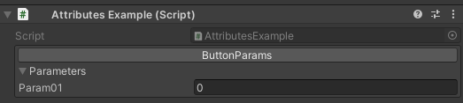
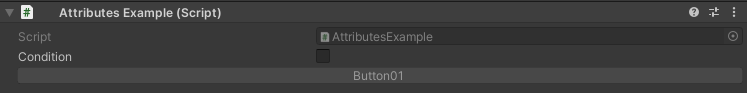
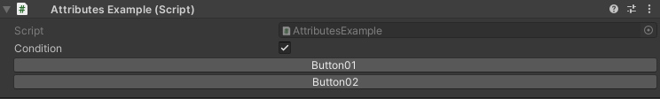
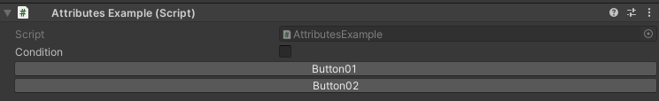
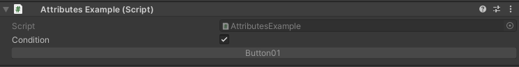

Button Attribute
================

Attribute to add a button in the inspector.

**Parameters:**
	- ``string`` conditionName: The name of the condition to evaluate
	- ``object`` enumValue: The value of the enum condition
	- ``ConditionResult`` conditionResult: What happens to the property when the condition evaluates to true
	- `optional`, ``bool`` negate: Negate the evaluated condition
	- `optional`, ``string`` buttonLabel: The label displayed on the button
	- `optional`, ``float`` buttonHeight: The height of the button

Example::

	using UnityEngine;
	using EditorAttributes;
	
	public class AttributesExample : MonoBehaviour
	{
		[Button]
		public void Button() => print("Hello World!");
	
		[Button("Button", 30f)]
		public void TallButton() => print("Im Tall!");
	}

.. image:: ../Images/Button01.png

If your function has parameters they will be displayed under the button as a foldout::

	using UnityEngine;
	using EditorAttributes;
	
	public class AttributesExample : MonoBehaviour
	{
		[Button]
		public void ButtonParams(int param01) => print(param01);
	}

.. note::
	``Array``, ``List``, ``UnityEvent``, ``struct``, ``enum`` and ``out`` or ``ref`` parameters are not supported

.. note::
	Because of the way the button parameters are serialized if you have multiple of the same component on one object the button parameters will share values, same applies to multiple objects
	with the same name and component. If you delete the duplicate object or component it will reset the parameters to the default values

You can also enable/disable or show/hide buttons based on a given condition::

	using UnityEngine;
	using EditorAttributes;
	
	public class AttributesExample : MonoBehaviour
	{
		[SerializeField] private bool condition;
	
		[Button(nameof(condition), ConditionResult.EnableDisable)]
		public void Button01() => print("Hello World!");
	
		[Button(nameof(condition), ConditionResult.ShowHide)]
		public void Button02() => print("Hello World!");
	}

Now the buttons will be disabled/hidden by default until the `condition` is true

If you wish for the button to be enabled/shown by default and disabled/hidden when the `conditon` is true, you can set the `negate` parameter to true::

	using UnityEngine;
	using EditorAttributes;
	
	public class AttributesExample : MonoBehaviour
	{
		[SerializeField] private bool condition;
	
		[Button(nameof(condition), ConditionResult.EnableDisable, true)]
		public void Button01() => print("Hello World!");
	
		[Button(nameof(condition), ConditionResult.ShowHide, true)]
		public void Button02() => print("Hello World!");
	}

You can also use an ``enum`` as a condition the same way you would use it on the :doc:`enablefield`, :doc:`disablefield`, :doc:`showfield`, :doc:`hidefield` and :doc:`messagebox`.

.. note::
	The attribute won't work inside a serialized ``struct``