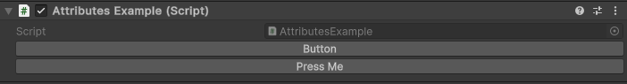

Button Attribute
================

Attribute to add a button in the inspector.

**Parameters:**
	- ``string`` functionName: The name of the function to call when the button is pressed
	- `optional`, ``string`` buttonLabel: The label displayed on the button
	
Because a function is not a property that can be displayed in the editor we need to have a holder variable to attach the attribute to.

.. note::
	The function must be public for it to be serialized and it cannot have parameters.

::
	using UnityEngine;
	using EditorAttributes;
	
	public class AttributesExample : MonoBehaviour
	{
		// Button will default to the function name as a label
		[SerializeField, Button(nameof(Button))] private Void buttonHolder01;
	
		// Button with a custom label
		[SerializeField, Button(nameof(Button), "Press Me")] private Void buttonHolder02;
	
		public void Button() => print("Hello World!");
	}

.. note::
	The attribute cannot look for functions inside a struct and it doesn't work well if the holder is an array or list