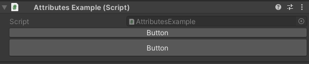
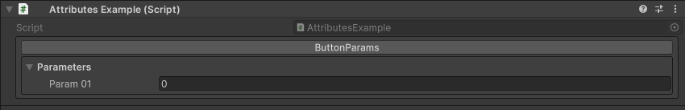

Button Attribute
================

Attribute to add a button in the inspector.

**Parameters:**
	- `optional`, ``string`` buttonLabel: The label displayed on the button
	- `optional`, ``float`` buttonHeight: The height of the button

Example::

	using UnityEngine;
	using EditorAttributes;
	
	public class AttributesExample : MonoBehaviour
	{
		[Button]
		public void Button() => print("Hello World!");
	
		[Button("Button", 30f)]
		public void TallButton() => print("Im Tall!");
	}

If your function has parameters they will be displayed under the button as a foldout::

	using UnityEngine;
	using EditorAttributes;
	
	public class AttributesExample : MonoBehaviour
	{
		[Button]
		public void ButtonParams(int param01) => print(param01);
	}

.. note::
	`Arrays`, `Lists`, `UnityEvents` and ``out`` or ``ref`` parameters are not supported

.. note::
	The attribute won't work inside a serialized `struct`