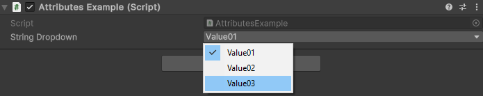

Dropdown Attribute
==================
Attribute to make a string dropdown menu out of a string array.

**Parameters:**
	- ``string`` stringArrayName: The name of the string array (A list can also be used)
	
.. note::
	The dropdown attribute can only be attached to a string field.

Example::

	using UnityEngine;
	using EditorAttributes;
	
	public class AttributesExample : MonoBehaviour
	{
		[SerializeField, Dropdown(nameof(dropdownValue))] private string stringDropdown;
	
		// The array needs to be serialized, but we don't want it to show in the inspector
		[SerializeField, HideInInspector]
		private string[] dropdownValue = new string[]
		{
			"Value01", "Value02", "Value03"
		};
	}

Now you can specify the value of a string from a dropdown.

	
.. note::
	The attribute cannot look for fields inside a ``struct``