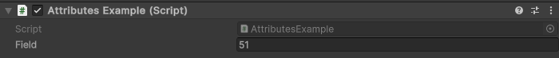
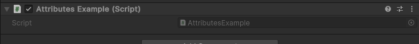

HideInPlaymode Attribute
=======================

Attribute to hide a field when entering play mode::
	
	using UnityEngine;
	using EditorAttributes;
	
	public class AttributesExample : MonoBehaviour
	{
		[HideInPlayMode] public int field = 51;
	}

Outside of playmode:

During playmode:

.. note:: 
	It cannot hide arrays or lists, only the fields inside them
