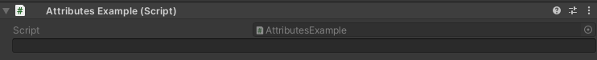

HideLabel Attribute
===================

Attribute to hide the label of a field in the inspector

Example::

	using UnityEngine;
	using EditorAttributes;
	
	public class AttributesExample : MonoBehaviour
	{
		[SerializeField, HideLabel] private string stringField;
	}

