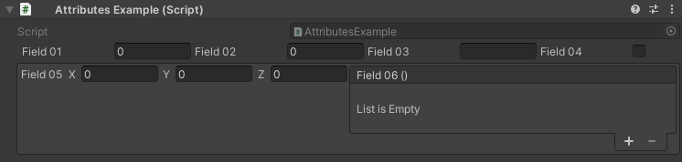

HorizontalField Attribute
=========================
Attribute to display specified fields horizontally.

**Parameters:**
	- `optional`, ``float`` labelWidth: The width of the field labels
	- `optional`, ``float`` fieldWidth: The width of the input fields
	- `params`, ``string`` fieldsToGroup: The name of the fields to group

Example::
	
	using UnityEngine;
	using EditorAttributes;
	using UnityEngine.Events;
	
	public class AttributesExample : MonoBehaviour
	{
		[SerializeField, HorizontalGroup(nameof(field01), nameof(field02), nameof(field03), nameof(field04))] 
		private Void groupHolder01;
	
		[SerializeField, HorizontalGroup(nameof(field05), nameof(field06), nameof(field07))]
		private Void groupHolder02;
	
		// The fields needs to be serialized, but we don't want them to show in the inspector
		[SerializeField, HideInInspector] private int field01;
		[SerializeField, HideInInspector] private float field02;
		[SerializeField, HideInInspector] private string field03;
		[SerializeField, HideInInspector] private bool field04;
	
		[SerializeField, HideInInspector] private Vector3 field05;
		[SerializeField, HideInInspector] private string[] field06;
		[SerializeField, HideInInspector] private UnityEvent field07;
	}

.. note::
	The attribute cannot look for fields inside a ``struct``
