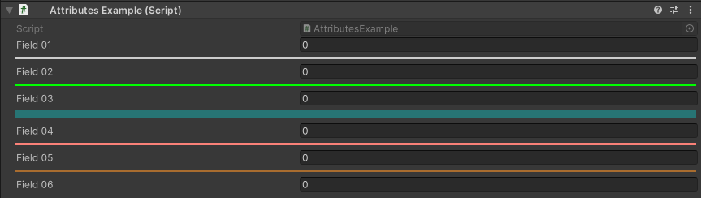

Line Attribute
==============

Attribute to draw a line in the inspector

**Parameters:**
	- ``float`` red: Red amount
	- ``float`` green: Green amount
	- ``float`` blue: Blue amount
	- ``string`` hexColor: The color in hexadecimal
	- `optional`, ``LineColor`` color: The color of the line
	- `optional`, ``float`` alpha: Alpha amount

Example::

	using UnityEngine;
	using EditorAttributes;
	
	public class AttributesExample : MonoBehaviour
	{
		[SerializeField] private int field01;
		[Line]
		[SerializeField] private int field02;
		[Line(LineColor.Green)]
		[SerializeField] private int field03;
		[Line(LineColor.Cyan, 0.3f)]
		[SerializeField] private int field04;
		[Line(250f, 129f, 120f)]
		[SerializeField] private int field05;
		[Line("#a86c2f")]
		[SerializeField] private int field06;
	}

