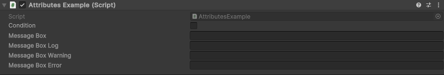
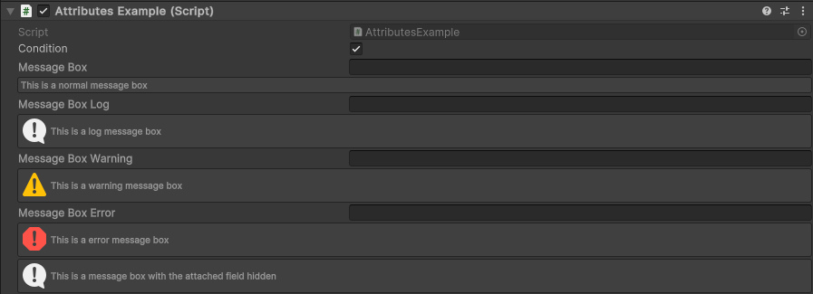

MessageBox Attribute
====================

Attribute to display a message box depending on a condition.

**Parameters:**
	- ``string`` message: The message to display
	- ``string`` conditionName: The condition to evaluate
	- `optional`, ``bool`` drawProperty: Draw the property this attribute is attached to
	- ``MessageMode`` messageType: The type of the message

Example::

	using UnityEngine;
	using EditorAttributes;
	
	public class AttributesExample : MonoBehaviour
	{
		[SerializeField] private bool condition;
	
		[SerializeField, MessageBox("This is a normal message box", nameof(condition), MessageMode.None)] 
		private string messageBox;
	
		[SerializeField, MessageBox("This is a log message box", nameof(condition), MessageMode.Log)]
		private string messageBoxLog;
	
		[SerializeField, MessageBox("This is a warning message box", nameof(condition), MessageMode.Warning)]
		private string messageBoxWarning;
	
		[SerializeField, MessageBox("This is a error message box", nameof(condition), MessageMode.Error)]
		private string messageBoxError;
	
		[SerializeField, MessageBox("This is a message box with the attached field hidden", nameof(condition), false)]
		private Void messageBoxHolder;
	}

The message boxes will show only when the condition is true.

.. note::
	Doesn’t work well with arrays or lists and it cannot look for the condition inside a struct