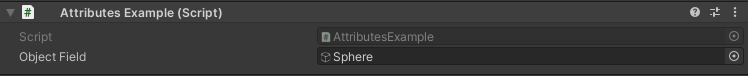

Required Attribute
==================

Attribute to display an error helpbox when a object field is null in the inspector

Example::

	using UnityEngine;
	using EditorAttributes;
	
	public class AttributesExample : MonoBehaviour
	{
		[SerializeField, Required] private GameObject objectField;
	}

.. image:: ../Images/Required01.png

