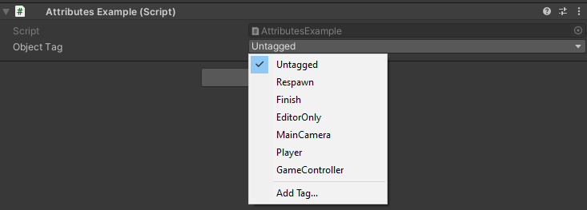

TagDropdown Attribute
=====================

Attribute to make a dropdown of tags

.. note::
	The `TagDropdown` can only be attached on a string

Example::

	using UnityEngine;
	using EditorAttributes;
	
	public class AttributesExample : MonoBehaviour
	{
		[SerializeField, TagDropdown] private string objectTag;
	}

