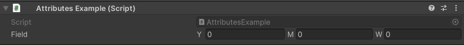

How To Use
==========

Prerequisites: Familiarity with basic C# programming in Unity and knowledge about how to use Unity's built-in attributes.

Importing The Namespace
-----------------------

To start using the editor attributes you must add this using statement in your class::

	using EditorAttributes;

If you are using `Assembly Definitions <https://docs.unity3d.com/2023.3/Documentation/Manual/ScriptCompilationAssemblyDefinitionFiles.html>`_ in your project make sure you reference the “EditorAttributes” Assembly Definition where needed.

.. image:: ../Images/HowToUse01.png

Serialization
-------------

Every field the attribute is attached to must be serializable by Unity, meaning those fields must be either public or private with the 
`SerializeField Attribute <https://docs.unity3d.com/2023.3/Documentation/ScriptReference/SerializeField.html>`_ and valid to the Unity serializer.

Here is an exammple of what's valid and what's not::

	// Valid, public fields are serialized by default
	public int field01;
	
	// Valid, is still a public field, we just mark it to be hidden in the inspector
	[HideInInspector] public int field02;
	
	// Invalid, private fields are not serialized by default
	private int field03;
	
	// Valid, we mark this private field to be serialized by unity
	[SerializeField] private int field04;
	
	// Valid, is still serialized, we just hide it in the inspector
	[SerializeField, HideInInspector] private int field05;
	
	// Invalid, static, readonly or const fields are not valid to unity's serializer
	public static int field06;
	
	// Invalid, Non-Behaivour classes are not serialized by unity, with the exception of lists
	public CustomRawClass field07;
	
	// Invalid, Interfaces are not serialized by unity (which is dumb)
	public IInterface field08;

Attribute Order
---------------

The logic of all attributes are executed in the order they are written (left to right), meaning the last attribute can override the functionality of the previous attribute
if the functionality is similar.
In the following example the :doc:`../Attributes/propertywidth` will execute after the :doc:`../Attributes/prefix` meaning the prefix will be added before the property width is set, so the 
:doc:`../Attributes/prefix` couldn't calculate it's position to be next to the field because the field width changed after the prefix was already calculated::

	using UnityEngine;
	using EditorAttributes;
	
	public class AttributesExample : MonoBehaviour
	{
		[Prefix("num"), PropertyWidth(100f)]
		[SerializeField] private int field;
	}

To fix this we can change the order by putting the :doc:`../Attributes/propertywidth` before the :doc:`../Attributes/prefix` or use the `order` parameter that every attribute has
to execute the :doc:`../Attributes/propertywidth` first, C# will first go trough the attributes with the lowest order from left to right then to the ones with the higher order the same way,
the default order of all attributes is 0::

	using UnityEngine;
	using EditorAttributes;
	
	public class AttributesExample : MonoBehaviour
	{
		[Prefix("num"), PropertyWidth(100f, order = -1)]
		[SerializeField] private int field;
	}

So now the :doc:`../Attributes/propertywidth` will be executed first and the :doc:`../Attributes/prefix` calculates it's position using the new width set by it.

.. image:: ../Images/HowToUse03.png
