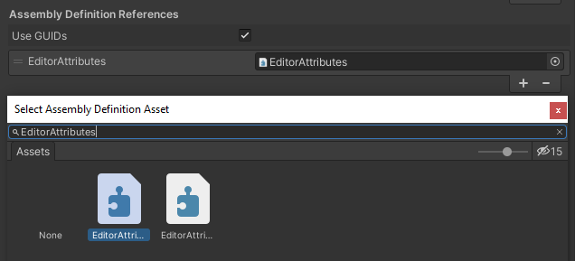

How To Use
==========

Prerequisites: Familiarity with basic C# programming in Unity and knowledge about how to use Unity's built-in attributes.

Importing The Namespace
-----------------------

To start using the editor attributes you must add this using statement in your class::

	using EditorAttributes;

If you are using Assembly Definitions in your project make sure you docerence the “Attributes” Assembly Definition where needed.

Serialization
-------------

Every field the attribute is attached to or the attribute is looking for must be serializable by Unity, 
meaning those fields must be either public or private with the SerializeField Attribute and valid to the Unity serializer.

Here is an exammple of what's valid and what's not::

	// Valid, public fields are serialized by default
	public int field01;
	
	// Valid, is still a public field, we just mark it to be hidden in the inspector
	[HideInInspector] public int field02;
	
	// Invalid, private fields are not serialized by default
	private int field03;
	
	// Valid, we mark this private field to be serialized by unity
	[SerializeField] private int field04;
	
	// Valid, is still serialized, we just hide it in the inspector
	[SerializeField, HideInInspector] private int field05;
	
	// Invalid, static, readonly or const fields are not valid to unity's serializer
	public static int field06;
	
	// Invalid, Non-Behaivour classes are not serialized by unity, with the exception of lists
	public CustomRawClass field07;
	
	// Invalid, Interfaces are not serialized by unity (which is dumb)
	public IInterface field08;

Attribute Order
---------------

The logic of all attributes are executed in the order they are written (left to right), meaning the last attribute can override the functionality of the previous attribute
if the functionality is similar.
In the following example the :doc:`../Attributes/readonly` Attribute will execute after the :doc:`../Attributes/button` Attribute meaning the `button` field will be made drawn over by the button then it will get disabled by the :doc:`../Attributes/readonly` Attribute,
leaving the button still enabled::

	using UnityEngine;
	using EditorAttributes;
	
	public class AttributesExample : MonoBehaviour
	{
		[Button(nameof(Button)), ReadOnly]
		[SerializeField] private Void button;
	
		public void Button() => print("Hello World!");
	}

.. image:: ../Images/temp.png

To fix this and have the button disabled we can change the other by putting the :doc:`../Attributes/readonly` Attribute before the :doc:`../Attributes/button` Attribute or use the `order` property that every attribute has
to execute the :doc:`../Attributes/readonly` Attribute first, C# will first go trough the attributes with the lowest order from left to right then to the ones with the higher order the same way,
the default order of all attributes is 0::

	using UnityEngine;
	using EditorAttributes;
	
	public class AttributesExample : MonoBehaviour
	{
		[Button(nameof(Button)), ReadOnly(order = -1)]
		[SerializeField] private Void button;
	
		public void Button() => print("Hello World!");
	}

So now the :doc:`../Attributes/readonly` Attribute will be executed first disabling the field before it becomes a button and now the button will be drawn as disabled.

.. image:: ../Images/temp.png
