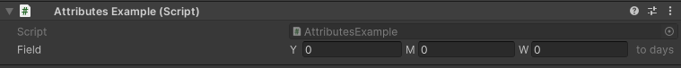

How To Use
==========

Prerequisites: Familiarity with basic C# programming in Unity and knowledge about how to use Unity's built-in attributes.

Importing The Namespace
-----------------------

To start using the editor attributes you must add this using statement in your class::

	using EditorAttributes;

If you are using `Assembly Definitions <https://docs.unity3d.com/2023.3/Documentation/Manual/ScriptCompilationAssemblyDefinitionFiles.html>`_ in your project make sure you reference the “EditorAttributes” Assembly Definition where needed.

.. image:: ../Images/HowToUse01.png

Serialization
-------------

Every member the attribute is attached to must be serializable by Unity (with the exception of the :doc:`../Attributes/ButtonAttributes/button` which is attached to functions), 
meaning those members must be either public or private with the `SerializeField Attribute <https://docs.unity3d.com/2023.3/Documentation/ScriptReference/SerializeField.html>`_ and valid to the Unity serializer.

Here is a small example of what's valid and what's not::

	// Valid, public fields are serialized by default
	public int field01;
	
	// Valid, is still a public field, we just mark it to be hidden in the inspector
	[HideInInspector] public int field02;
	
	// Invalid, private fields are not serialized by default
	private int field03;
	
	// Valid, we mark this private field to be serialized by unity
	[SerializeField] private int field04;
	
	// Valid, is still serialized, we just hide it in the inspector
	[SerializeField, HideInInspector] private int field05;
	
	// Invalid, static, readonly or const fields are not valid to unity's serializer
	public static int field06;
	
	// Invalid, Non-Behaivour classes and structs that are not marked as serializable are not serialized by unity
	public CustomRawClass field07;

For more details about unity serialization see `this <https://docs.unity3d.com/Manual/script-Serialization.html>`_

Attribute Order
---------------

The logic of all attributes is executed in the order they are written (left to right), meaning the last attribute can override the functionality of the previous attribute if the functionality is similar.
In the following example the :doc:`../Attributes/NumericalAttributes/timefield` will execute before the :doc:`../Attributes/DecorativeAttributes/suffix` 
meaning the suffix will fail to add because of how the :doc:`../Attributes/NumericalAttributes/timefield` is drawn::

	using UnityEngine;
	using EditorAttributes;
	
	public class AttributesExample : MonoBehaviour
	{
		[TimeField(TimeFormat.YearMonthWeek, ConvertTo.Days), Suffix("to days")]
		[SerializeField] private int field;
	}

.. image:: ../Images/HowToUse02.png

To fix this we can change the order by putting the :doc:`../Attributes/NumericalAttributes/timefield` after the :doc:`../Attributes/DecorativeAttributes/suffix` or use the `order` parameter that every attribute has
to execute the :doc:`../Attributes/DecorativeAttributes/suffix` first, C# will first go through the attributes with the lowest order from left to right then to the ones with the higher order the same way,
the default order of all attributes is 0::

	using UnityEngine;
	using EditorAttributes;
	
	public class AttributesExample : MonoBehaviour
	{
		[TimeField(TimeFormat.YearMonthWeek, ConvertTo.Days), Suffix("to days", order = -1)]
		[SerializeField] private int field;
	}

So now the :doc:`../Attributes/DecorativeAttributes/suffix` will be executed first and the :doc:`../Attributes/NumericalAttributes/timefield` will draw the field with the suffix already on it.

Finding members
---------------

Some attributes like :doc:`../Attributes/DropdownAttributes/dropdown`, :doc:`../Attributes/MiscellaneousAttributes/validate` or :doc:`../Attributes/ConditionalAttributes/index` 
will ask for the name of a member to use for their functionality, these members do not abide by Unity's serialization rules, 
meaning they can can be fields, properties or functions, inherited or nested, marked with any `access modifier <https://learn.microsoft.com/en-us/dotnet/csharp/programming-guide/classes-and-structs/access-modifiers>`_ 
and be ``static``, ``readonly`` or ``const``.

.. :note:
	The :doc:`../Attributes/GroupingAttributes` are the only attributes that abide by Unity's serialization rules for finding members since they have to draw those members in the inspector.

You can also input members that are inside a different type as long as they are ``const`` or ``static``::

	using UnityEngine;
	using EditorAttributes;
	
	public class AttributesExample : MonoBehaviour
	{	
		[Dropdown("ExampleClass.GetDropdownValues")]
		[SerializeField] private string dropdown;
	}
	
	public class ExampleClass
	{
		public static string[] GetDropdownValues() => new string[] { "Option 1", "Option 2", "Option 3" };
	}

DO NOT use the `nameof <https://learn.microsoft.com/en-us/dotnet/csharp/language-reference/operators/nameof>`_ expression if you are passing members from another class since it will only return
the name of the member itself not its path::

	using UnityEngine;
	using EditorAttributes;
	
	public class AttributesExample : MonoBehaviour
	{	
		[Dropdown(nameof(ExampleClass.GetDropdownValues))]
		[SerializeField] private string example01;
	
		[Dropdown("ExampleClass.GetDropdownValues")]
		[SerializeField] private string example02;
	}
	
	public class ExampleClass
	{
		public static string[] GetDropdownValues() => new string[] { "Option 1", "Option 2", "Option 3" };
	}
	

If your type containing the member is inside of a namespace you need to input the entire path to that member::

	using UnityEngine;
	using EditorAttributes;
	
	public class AttributesExample : MonoBehaviour
	{
		[Dropdown("ExampleClass.GetDropdownValues")]
		[SerializeField] private string example01;
		
		[Dropdown("Example.ExampleClass.GetDropdownValues")]
		[SerializeField] private string example02;
	}
	
	namespace Example 
	{
		public class ExampleClass
		{
			public static string[] GetDropdownValues() => new string[] { "Option 1", "Option 2", "Option 3" };
		}
	}

