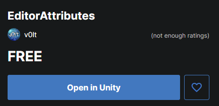
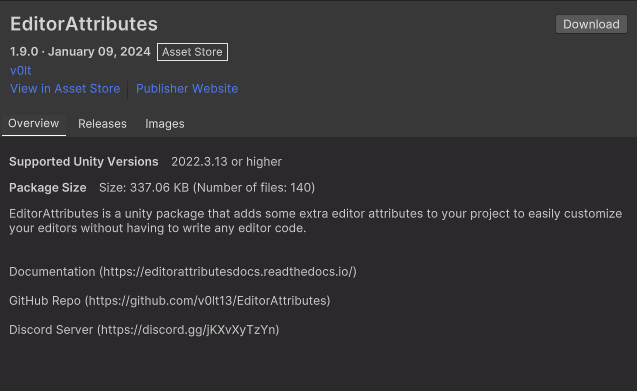
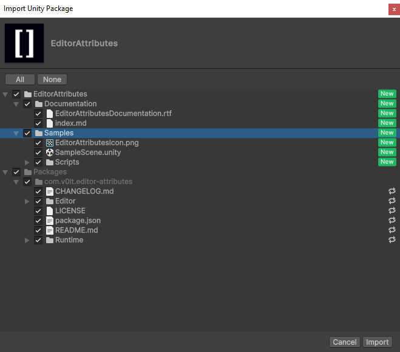
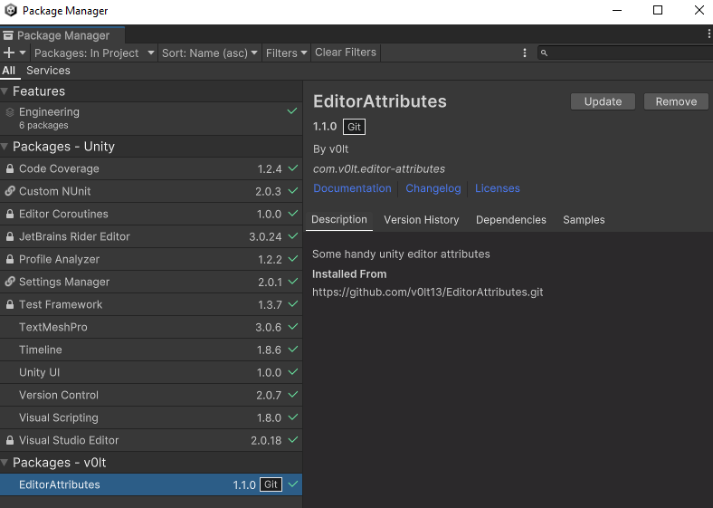

Installation
============

To begin using this package you must first import it into your unity project.

Via GitHub
----------

First copy the **HTTPS** link from the `repository <https://github.com/v0lt13/EditorAttributes>`_.

.. image:: ../Images/Instalation01.png

Inside your project open the package manager window click the ``+`` button then `"Install package from git URL…"`.

.. image:: ../Images/Instalation02.png

In the text field paste the link copied from before and click install.

Now the package is available to use in your project!

Via AssetStore
--------------

First go to the `store page <https://assetstore.unity.com/packages/tools/gui/editorattributes-269285>`_. of the package, add the package to your assets, then click the **Open in Unity** button, 
make sure you have your Unity project open.

The Unity package manager should open now displaying the asset, simply click the download button.

Once the package has downloaded click the import button, choose if you wish to import the offline documentation, samples or any other file and once you're done click import.

Now the package is available to use in your project!

Updating
--------

Whenever there is a new update to the package just go to your package manager, look for the **EditorAttributes** package, select it, and click the update button.

Yeah, is that easy.
