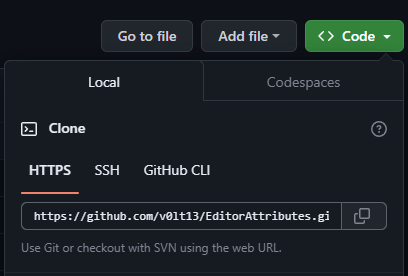
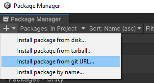

Installation
============

To begin using this package you must first import it into your unity project.

First copy the HTTPS link from the `repository <https://github.com/v0lt13/EditorAttributes>`_.

Inside your project open the package manager window click the '+' button then "Install package from git URL…".

In the text field paste the link copied from before and click install.

Now the package is available to use in your project!
